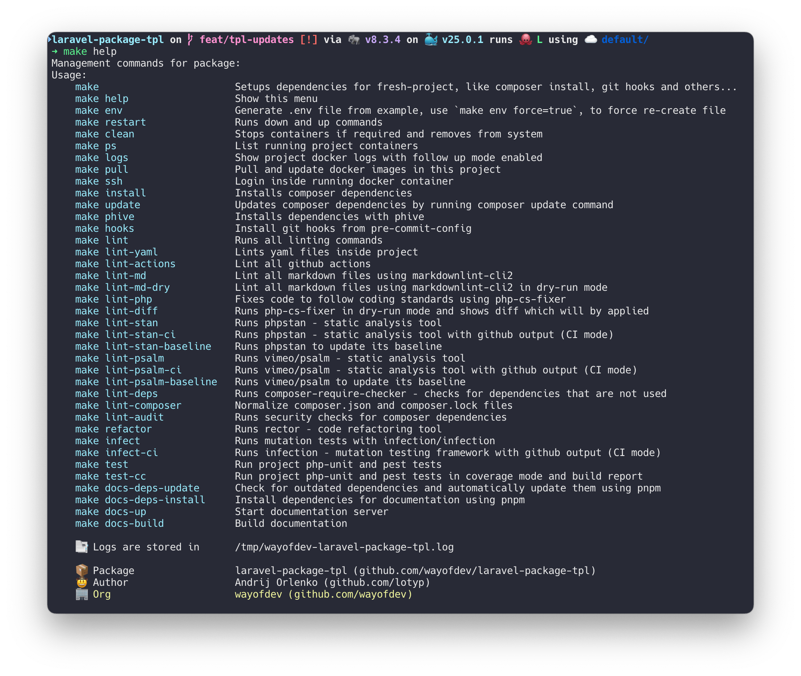

<p align="center">
    <br>
    <a href="https://wayof.dev" target="_blank">
        <picture>
            <source media="(prefers-color-scheme: dark)" srcset="https://raw.githubusercontent.com/wayofdev/.github/master/assets/logo.gh-dark-mode-only.png">
            
        </picture>
    </a>
    <br>
</p>

<p align="center">
    <strong>Build</strong><br>
    <a href="https://github.com/wayofdev/laravel-package-tpl/actions" target="_blank"></a>
</p>
<p align="center">
    <strong>Project</strong><br>
    <a href="https://packagist.org/packages/wayofdev/laravel-package-tpl" target="_blank"></a>
    <a href="https://packagist.org/packages/wayofdev/laravel-package-tpl" target="_blank"></a>
    <a href="https://packagist.org/packages/wayofdev/laravel-package-tpl" target="_blank"></a>
    <a href="https://packagist.org/packages/wayofdev/laravel-package-tpl" target="_blank"></a>
</p>
<p align="center">
    <strong>Quality</strong><br>
    <a href="https://app.codecov.io/gh/wayofdev/laravel-package-tpl" target="_blank"></a>
    <a href="https://dashboard.stryker-mutator.io/reports/github.com/wayofdev/laravel-package-tpl/master" target="_blank"></a>
    <a href=""></a>
</p>
<p align="center">
    <strong>Community</strong><br>
    <a href="https://discord.gg/CE3TcCC5vr" target="_blank"></a>
    <a href="https://x.com/intent/follow?screen_name=wayofdev" target="_blank"></a>
</p>

<br>

# Laravel Package Template

This is a template repository designed to kick-start the development of Laravel packages with essential tools and setups pre-configured.

<br>

If you **like/use** this package, please consider ⭐️ **starring** it. Thanks!



## 🚀 Features

This template repository includes several features to streamline the development of Laravel packages:

### → Testing

- Configured [PHPUnit](https://phpunit.de/index.html) for unit testing.
- Integrated [Pest PHP](https://pestphp.com) for elegant console support and architecture testing.
- [Orchestra Testbench](https://packages.tools/testbench.html) for Laravel package testing.
- [PHPStan](https://phpstan.org) extensions for PHPUnit and Laravel.
- Infection for mutation testing to ensure quality.
- Mutation test reports are uploaded [Stryker Mutator Dashboard](https://dashboard.stryker-mutator.io).

### → Static Analysis

- [PHPStan](https://phpstan.org) for static analysis, ensuring code quality and robustness.
- [Larastan](https://github.com/larastan/larastan) for Laravel-specific static analysis.
- [PHPStan strict rules](https://github.com/phpstan/phpstan-strict-rules) for enforcing strict type checks and standards.
- [Psalm](https://psalm.dev) for finding errors in PHP applications through static analysis.
- [PHP Rector](https://github.com/rectorphp/rector) for automated code upgrades and refactoring, maintaining modern code standards.

### → Coding Standards

- [PHP CS Fixer Config](https://github.com/wayofdev/php-cs-fixer-config) with custom configuration for consistent code style.
- [Composer Normalize](https://github.com/ergebnis/composer-normalize) to ensure a consistent `composer.json` format.
- [Yamllint](https://github.com/adrienverge/yamllint) for YAML file linting.
- [Actionlint](https://github.com/rhysd/actionlint) for GitHub Actions workflow linting.
- [Markdownlint](https://github.com/DavidAnson/markdownlint-cli2) for Markdown file linting.

### → Continuous Integration

- Automated testing with code coverage report generation using PHPUnit and Xdebug, uploaded to [Codecov](https://about.codecov.io).
- Automated linting of YAML files using [ibiqlik/action-yamllint](https://github.com/ibiqlik/action-yamllint).
- Automated PHP code linting to ensure code quality and standards using [wayofdev/php-cs-fixer-config](https://github.com/wayofdev/php-cs-fixer-config).
- Markdown linting using [DavidAnson/markdownlint-cli2](https://github.com/DavidAnson/markdownlint-cli2).
- Checks for outdated or insecure dependencies using Composer.
- Mutation testing with [Infection](https://github.com/infection/infection) and [Stryker Mutator](https://stryker-mutator.io) to assess the quality of the test suite.
- Security checks to identify vulnerabilities in dependencies.
- Comprehensive static analysis with [PHPStan](https://phpstan.org) and [Psalm](https://psalm.dev).
- Extensive testing across different setups to ensure compatibility and stability.

### → Development Environment

- Docker support for consistent development environments.
- [Pre-commit](https://pre-commit.com) hooks setup to ensure code quality before commits.

### → Issue Templates

- This package is equipped with a set of ready-to-use issue templates to streamline contributions and issue reporting.

  You can find these templates organized in the [`.github/ISSUE_TEMPLATE`](.github/ISSUE_TEMPLATE) directory.

### → Miscellaneous

- Support for PHP 8.2+ and Laravel 10.x/11.x.
- Configured `autoload` and `autoload-dev` for optimal namespace management.
- PHAR dependencies managed using [Phive](https://phar.io/).

<br>

## 💿 Installation

To use this template, clone the repository and install the dependencies:

```bash
$ git clone https://github.com/wayofdev/laravel-package-tpl.git
$ cd laravel-package-tpl

$ make env install

### full list of available commands:
$ make help
```

<br>

## 🧪 Running Tests

### → PHPUnit tests

To run tests, run the following command:

```bash
make test
```

### → Mutation tests

To run mutation tests, using [`infection/infection`](https://github.com/infection/infection):

```bash
make infect
```

### → Static Analysis

Code quality using PHPStan:

```bash
make lint-stan
```

and using Psalm:

```bash
make lint-psalm
```

### → Coding Standards Fixing

Fix code using The PHP Coding Standards Fixer (PHP CS Fixer) to follow our standards:

```bash
make lint-php
```

### → Lint Yaml files

Lint all yaml files in project:

```bash
make lint-yaml
```

### → Lint Markdown files

Lint all yaml files in project:

```bash
make lint-md
```

### → Lint GitHub Actions

Lint all yaml files in project:

```bash
make lint-actions
```

<br>

## 🔒 Security Policy

This project has a [security policy](.github/SECURITY.md).

<br>

## 🙌 Want to Contribute?

Thank you for considering contributing to the wayofdev community! We are open to all kinds of contributions. If you want to:

- 🤔 [Suggest a feature](https://github.com/wayofdev/laravel-package-tpl/issues/new?assignees=&labels=type%3A+enhancement&projects=&template=2-feature-request.yml&title=%5BFeature%5D%3A+)
- 🐛 [Report an issue](https://github.com/wayofdev/laravel-package-tpl/issues/new?assignees=&labels=type%3A+documentation%2Ctype%3A+maintenance&projects=&template=1-bug-report.yml&title=%5BBug%5D%3A+)
- 📖 [Improve documentation](https://github.com/wayofdev/laravel-package-tpl/issues/new?assignees=&labels=type%3A+documentation%2Ctype%3A+maintenance&projects=&template=4-docs-bug-report.yml&title=%5BDocs%5D%3A+)
- 👨‍💻 Contribute to the code

You are more than welcome. Before contributing, kindly check our [contribution guidelines](.github/CONTRIBUTING.md).

[](https://conventionalcommits.org)

<br>

## 🫡 Contributors

<p align="left">
<a href="https://github.com/wayofdev/laravel-package-tpl/graphs/contributors">

</a>
<br>
<br>
</p>

## 🌐 Social Links

- **Twitter:** Follow our organization [@wayofdev](https://twitter.com/intent/follow?screen_name=wayofdev) and the author [@wlotyp](https://twitter.com/intent/follow?screen_name=wlotyp).
- **Discord:** Join our community on [Discord](https://discord.gg/CE3TcCC5vr).

<br>

## ⚖️ License

[](./LICENSE.md)

<br>
